# FS 2020 Schematics Lab
## Introduction

This lab will introduce you to the concepts within Schematics and how to create a VPC, setup two zones each with a subnet, and place a virtual instance in each as well as deploy a load balancer attached to the servers. A simple cloud-init script will install nginx, just to showcase an http response for proving out the example.

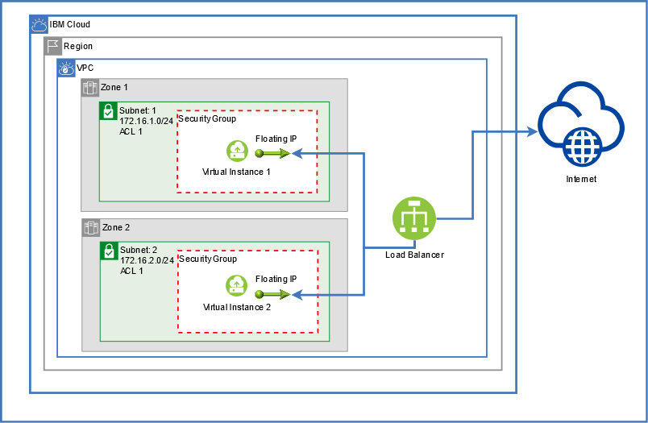


## Prerequisites

1. You must have an IBM Cloud account. You can sign up for a trial account if you do not have an account. The account will require the IBMid. If you do not have an IBMid, register and one will be created.

2. Check to make certain you have the appropriate role access on your account to provision infrastructure. If you are assigned an IBM Cloud Schematics service access role, you can view, create, update, or delete workspaces in IBM Cloud Schematics. To provision the IBM Cloud resources that you defined in your Terraform template, you must be assigned the IAM platform or service access role that is required to provision the individual resource. Refer to the [documentation](https://cloud.ibm.com/docs/home/alldocs) for your resource to determine the access policies that you need to provision and work with your resource. To successfully provision IBM Cloud resources, users must have access to a paid IBM Cloud account. Charges incur when you create the resources in the IBM Cloud account, which is initiated by clicking the Apply plan button. Here's a link to the docs for [Schematics Access](https://cloud.ibm.com/docs/schematics?topic=schematics-access).

3. In this lab we will be using the following resources. Double-check your access prior to applying the plan.
- Schematics
- VPC Infrastructure

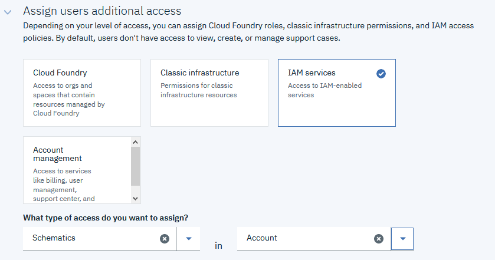

4. A SSH Key will be required to create the virtual instances. You will need to populate the ssh_public_key variable with the contents of your private key. To find out how to create or locate your public key, follow these instructions. [SSH Public Key Docs](https://cloud.ibm.com/docs/vpc?topic=vpc-ssh-keys#locating-ssh-keys). If you do not have the ability to create a SSH Key, use this [Example Public Key](https://raw.githubusercontent.com/Cloud-Schematics/fs2020/master/example.pubkey). If you use the example key, you will not be able authenticate to the instances, but the lab will still function.

5. If you want to modify the variables for Image and Compute Profile, you will need to obtain these values from the IBM CLI. If you do not have the IBM Cloud CLI you will need to install locally to be able to use these commands.
For Gen2 resource interaction via the CLI, you are required to have the infrastructure-services plugin.

`ibmcloud plugin install infrastructure-service`

This lab will be using Gen 2 of the VPC. Set your CLI to target Gen2.

`ibmcloud is target --gen 2`

List the available images, and record the ID of the image in which you wish to use. Ubuntu 18.04 is set by default.

`ibmcloud is images list`

List the available Compute profiles and record the Name of the profile in which you wish to use. cx2-2x4 is set by default.

`imbcloud is instance-profiles`

6. If you choose to do the optional steps at the end of the lab, you must fork the project into your own repo so that you can make the required modifications and push back into your repo. If you choose to not do the additional steps, or do not have a Github account available, you can just use the lab Git url, but will not have the ability to modify any of the plan. All modifications will only be done via the variables available.

## Task 1: Get Familiar with the Terraform Templates
Within the project, there are various files in which you will need to have familiarity with, as well as know which variables you will be required to specify values for.

- **provider.tf** - Setup for the IBM Provider as well as the required credentials to be used.
- **variables.tf** - Holds the variables and possible default values to be used for the plan.
- **main.tf** - This file holds the majority of the resources to be created, including the VPC and virtual instances.
- **lb.tf** - This file holds the Load Balancer resource as well as defining the pool members. 
- **cloud-init-apptier.tf** - This file contains the Cloud-Init script to be used for each virtual instance to install a simple nginx service.
- **outputs.tf** - This file contains the output variables that we want to see when the plan is executed and completed. 

## Task 2: Create a new Workspace

A Workspace is the defining environment in which you want to provision within Schematics. The resources defined by the Terraform templates will make up this Workspace. The Terraform templates reside within a GitHub or GitLab repository. For this lab, we will be using this GitHub repository ([https://github.com/Cloud-Schematics/fs2020](https://github.com/Cloud-Schematics/fs2020)) containing the Terraform template files to provision resources. 

1. Log in in to your IBM Cloud account via the portal. Navigate to the menu and select [Schematics](https://cloud.ibm.com/schematics).


- Click the 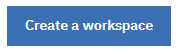 button.
- Provide a Workspace Name.
- Enter any tags in which you would like to specify.
- Select the Resource Group, this can also be reflected in the Plan variables.
- Add a description of your choice.

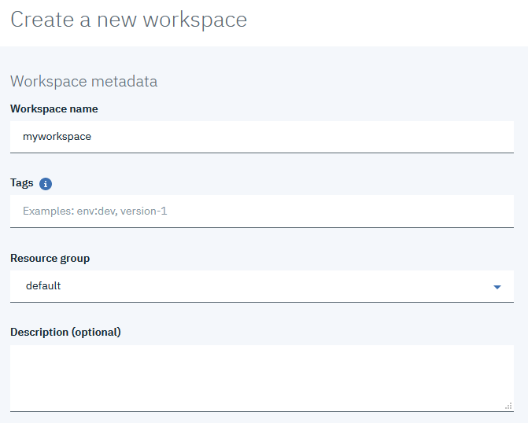

- Add the Github URL to this lab, or the forked URL from your own repository if you chose to use a fork.
- A personal access token should not be required since this lab uses a public GitHub repository.
- Click the "Retrieve input variables" button.

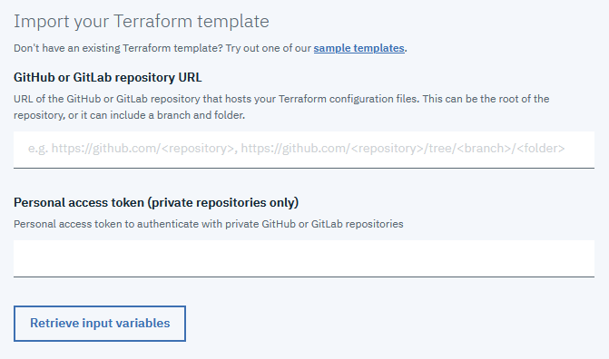

2. Upon clicking the "Retrieve input variables" button, Schematics will go out to the provided Github URL and retrieve the template files, also extracting out the variables that have been defined. You should now see the variables populated in a table on your screen. Update any variables for the items in which you choose to modify by entering a new value in the "Override value" textbox. Most variables will already have a default value assigned. You will also notice a sensitive checkbox for each variable. You should not need to secure any of these variables, but if you choose this option, the value will be hidden from the UI later.
- **ibmcloud_region** - Select the region in which you want to deploy the VPC into, default set to Dallas
- **vpc_name** - Provide a name for your VPC, this will also be used to prefix some other resources
- **zone1** - Enter the initial Zone to use within your region. default: us-south-1
- **zone2** - Enter a secondary Zone to use within the region. default: us-south-2
- **zone1_cidr** - Provide a valid CIDR block to use for your VPC
- **zone2_cidr** - Provide a valid CIDR block to use for your VPC
- **ssh_public_key** - Enter the contents of your SSH Public key to be used for the Virtual instances
- **image** - Provide the ID of the OS Image you wish to use
- **profile** - Provide the name of the Instance Profile type you wish to provision

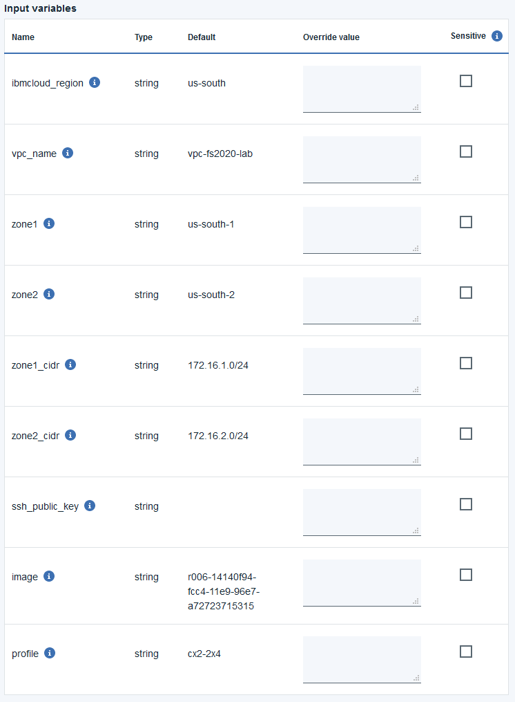

Once all of the values have been entered, click the "Create" button to finalize the new Workspace. This will not create any resources at this time. In the next steps we will look at executing the Plan.

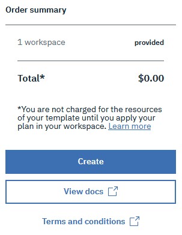

## Task 3: Apply the Plan

You now should have a Workspace created. The next step will be to Generate a Plan of your workspace template. Click "Generate plan" to create a Terraform execution plan. No resources will actually be created, but Schematics will go through the process of simulating the resource creation for the plan.

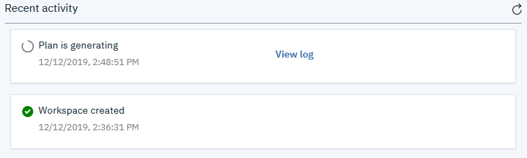

Click on the "View log" link to see the progress of the executing plan. The log will tail as each of the resources go through their steps. When the log completes, you should see a log output stating the number of resources that will be added, changed and destroyed. For this plan, only resources should be added.

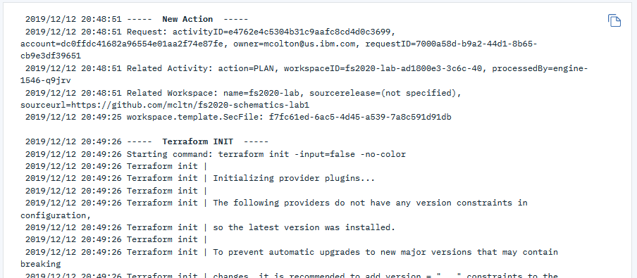


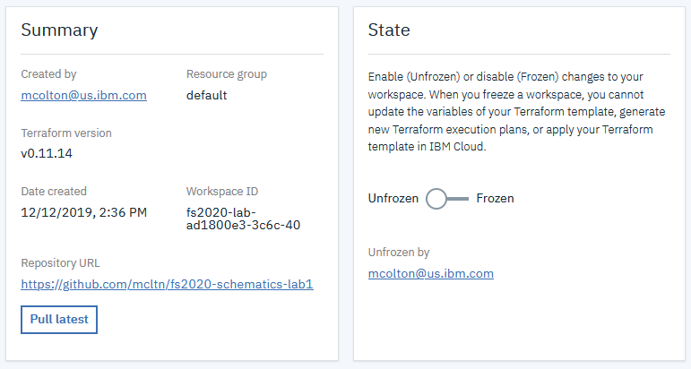

Now let's execute the plan to create the resources. Click the "Apply plan" button. Resources should now start provisioning. Like the "Generating Plan" step, you can also view the progress within the "View log" link while resources are being created. If any errors arise, you should see the reason within the log. This initial plan template should not have any issues, so if you have an issue, you may need to check your permissions and credentials.

## Task 4: Modify the Plan (optional)
**Skip to Task 5 if you do not have a fork of the Github repo to use**

So far in the lab we created infrastructure in two zones. We will now look into adding a third zone to the deployment so we have full coverage of the three zones in the region. We will look at each of the resources that we will need to add and modify in the plan templates.

1. First let's look into the variables that we think we will need to add to the project template. All variables are held within the `variables.tf` file. We currently have two zones specified, so we should add a third zone. We will also need to add the CIDR block to be used for the zone 3 address prefix and subnet. You can add any default value that you wish for this.

```
variable "zone3" {
  default = "us-south-3"
}
```

```
variable "zone3_cidr" {
  default = "172.16.3.0/24"
}
```

2. Now that we have the new variables defined, we will need to add the resources to the template. Here we will create a new Address Prefix (`ibm_is_vpc_address_prefix`) resource as well as a new Subnet (`ibm_is_subnet`) resource.

```
resource "ibm_is_vpc_address_prefix" "vpc-ap3" {
  name = "vpc-ap3"
  zone = "${var.zone3}"
  vpc  = "${ibm_is_vpc.vpc1.id}"
  cidr = "${var.zone3_cidr}"
}
```

```
resource "ibm_is_subnet" "subnet3" {
  name            = "subnet3"
  vpc             = "${ibm_is_vpc.vpc1.id}"
  zone            = "${var.zone3}"
  ipv4_cidr_block = "${var.zone3_cidr}"
  depends_on      = ["ibm_is_vpc_address_prefix.vpc-ap3"]
}
```

3. Next we will look at adding the new Compute Instance (`ibm_is_instance`) and also add a resource for the Floating IP (`ibm_is_floating_ip`). Additionally, if you wish to see the Floating IP address assigned to the third instance, you can add a new output variable in the `outputs.tf` file.

```
resource "ibm_is_instance" "instance3" {
  name    = "instance3"
  image   = "${var.image}"
  profile = "${var.profile}"

  primary_network_interface = {
    subnet = "${ibm_is_subnet.subnet3.id}"
  }
  vpc  = "${ibm_is_vpc.vpc1.id}"
  zone = "${var.zone3}"
  keys = ["${ibm_is_ssh_key.ssh1.id}"]
  user_data = "${data.template_cloudinit_config.cloud-init-apptier.rendered}"
}
```

```
resource "ibm_is_floating_ip" "floatingip3" {
  name = "fip3"
  target = "${ibm_is_instance.instance3.primary_network_interface.0.id}"
}
```

```
output "FloatingIP-3" {
    value = "${ibm_is_floating_ip.floatingip3.address}"
}
```


4. We have Security Group resources that get created, but these resources also have a `depends_on` array defined for the floating IP resources. We should add the zone 3 floating IP to these resources so they do not get created prior to all three zone floating IPs finish being created. This applies to both the `sg1_tcp_rule_22` and `sg1_tcp_rule_80` resources.

```
  depends_on = ["ibm_is_floating_ip.floatingip1", "ibm_is_floating_ip.floatingip2", "ibm_is_floating_ip.floatingip3"]
```

5. Now that we have all of the appropriate resources defined for the new additional zone, we can now add the Load Balancer Pool Member (`ibm_is_lb_pool_member`) for the third instance.

```
resource "ibm_is_lb_pool_member" "lb1-pool-member3" {
  count = 1
  lb = "${ibm_is_lb.lb1.id}"
  pool = "${ibm_is_lb_pool.lb1-pool.id}"
  port = "80"
  target_address = "${ibm_is_instance.instance3.primary_network_interface.0.primary_ipv4_address}"
}
```
6. After making all of the modifications to the appropriate files, you will now need to `commit` and `push` your changes back to your repository. Once you have completed this, and verified that the files have been pushed back into the repository, you will need to go back in to your Schematics Workspace, under Settings, and click "Pull Latest".

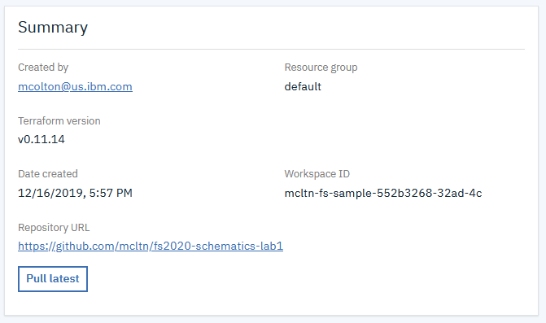

7. After you have pulled the latest changes into your Schematics Workspace, you should now see the new variables listed. Go ahead and provide values if you wish to modify them from the default values you may have specified. Also, make certain the CIDR block that you specify for zone 3, fits within the  VPC CIDR block that you previously configured.

8. Now with the variables updated and all of the new resources defined in your template, it is time to apply these changes. We can do this by going back to the "Activity" screen in your Schematics Workspace. Click the "Generate Plan" so we can see the modifications that will be made to the infrastructre. You will notice the resources that will need to be created as well as a few resources will be removed since they will be recreated. If the Plan is successful, you can now "Apply" the plan. If there were errors, try to figure out what may have caused the issue by viewing the log for the plan.

9. Follow the log as the resources are being created and/or recreated. At the end, take note of the URL, it should be the same as you had previously, and test that you get the nginx sample web page.

## Task 5: Delete Resources and Workspace

In this lab you have successfully built an initial 2 zone environment, attached a load balancer, and optionally learned how to add an additional zone to the plan. To finish up with this lab, all you need to do now is delete your resources. You can also delete the Workspace if you choose to not keep it.

1. Select the "Delete" option in the Action Menu to begin the process.


2. In the popup, select if you wish to remove the workspace or just the resources. Once you have made your selections, click the "Delete" button. This will begin the process of removing resources. Once it is started, you can follow the log to watch the progress of this step and wait for completion. 

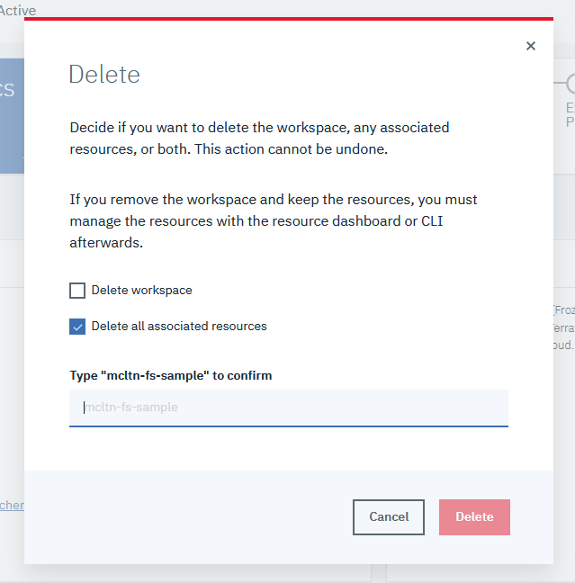

3. Congratulations, you have completed the lab. All resources should now be removed. Think of other ways you may be able to modify the template. Possibly try adding additional instances to each of the zones, and add them as members to the load balancer as well.

